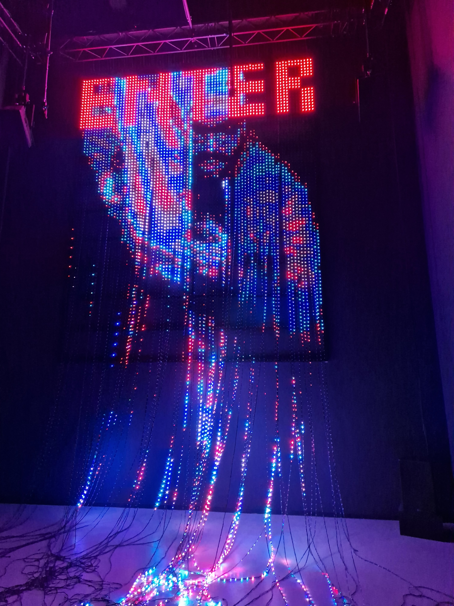
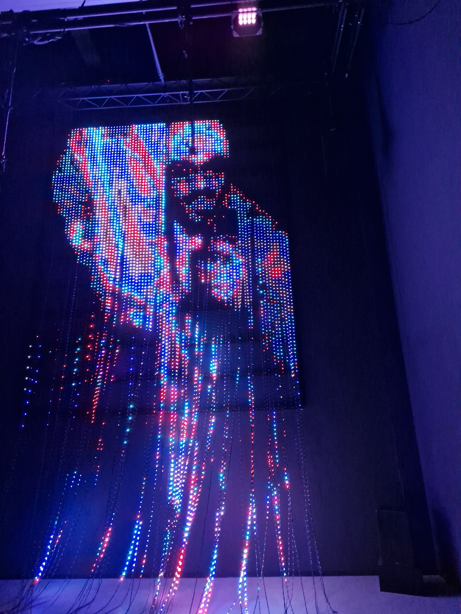
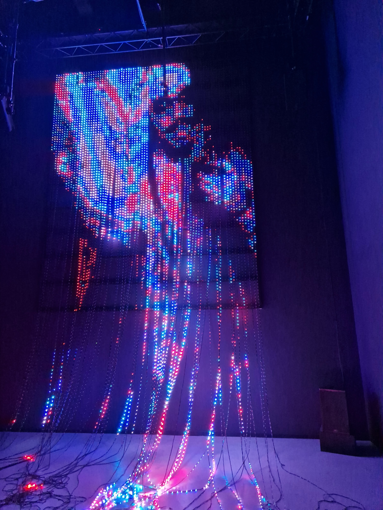

# NXT Museum

## Introductie
Deze weekly nerd is een beetje anders. Deze week zijn we namelijk bij het NXT Museum.in Amsterdam Noord.
NXT Museum is een museum dat zich focust op de toekomst van technologie en interactieve kunst.

## "Aparte" Kunst
Ik moet zeggen dat ik een heel dubbel gevoel had bij het museum. Ik vond het heel gaaf om te zien wat er allemaal mogelijk is met technologie en interactieve kunst. Maar ik vond het ook heel jammer dat sommige van die kunstwerken, voor mijn gevoel, gewoon heel raar waren en aanvoelden. En dan praat ik met namen over het "kunstwerk"/ video waar er een man aan zijn benden werd opgehangen en werd geslagen op zijn lichaam en geslachtsdeel. 

### De avatar
De mascotte van het museum of de "Avatar" vond ik ook maar een apart geval. Ik snap ergens wel dat zij de diepte in willen gaan met de technologie en dat ze willen laten zien wat er allemaal mogelijk is. Maar ik vond het gewoon een beetje raar.
<video src="../videos/avatar.mp4" controls title="De Avatar"></video>

## Favoriete Kunstwerken

### Foreign Nature
De Foreign Nature was een van mijn favoriete kunstwerken. hij was heel trippy, maar toch wel rustgevend gelijk. Op de wanden evn vloer werd teglijk een soort video afgespeeld, waardoor je het gevoel kreeg dat je in een soort van andere wereld was. Het was heel gaaf om te zien hoe de video op de wanden en vloer werd geprojecteerd.

Wat ik wel jammer vond is dat hij niet interactief was. Dan was dit waarschijnlijk mijn favoriet geweest.
<video src="../videos/relax-room.mp4" controls title="De Relax room"></video>

### Enter
Het kunstwerk dat voor mij het interessants was, was het kunstwerk "Enter". Dit kunstwerk was een interactive licht reflectie, waar je een soort pixelated versie van jezelf zag. Het was heel gaaf om te zien hoe je lichaam realtime werd omgezet in deze versie.

**Afbeeldingen**
| 1 | 2 | 3 |
| --- | --- | --- |
|  |  |  |

#### Technische analyse 
Om dit kunstwerk mogelijk denk ik dat zij gebruik maken van een soort camera die de persoon opneemt. Deze camera stuurt de beelden door naar een computer die de beelden omzet in een pixelated versie van de persoon aan de hand van veel en lange ledlampstrips.

Dit gebeurt allemaal super snel, dus ik neem aan dat zij hier een erg krachtige computer voor gebruiken.

Het feit dat je zelf ook invloed hebt op het kunstwerk, maakt het voor mij nog interessanter. Ik vind het ook heel apart dat ik mijzelf toch nog goed terug kan zien in de ladlampjes. Ik vraag mij af of dit heel veel moeite heeft gekost om dit zo voor el kaar te krijgen of dat hier libraries voor zijn.

## Reflectie 
Zoals eerder ik eerder al had gezegd, vond ik het heel gaaf om te zien wat er allemaal mogelijk is met technologie en interactieve kunst. Los van dat ik bepaalde kunstwerken heel apart vond en van sommige zelfs een beetje geschrokken was, leek me zelfs bij die kunstwerken de techniek erachter heel interresant.

Interactieve kunst is iets wat voor mij een stuk interessanter is geworden na dit bezoek. Normaal gesproken ben ik niet echt zo van de kunst, maar van dit soort kunstwerken zou ik er wel meer willen zien.

